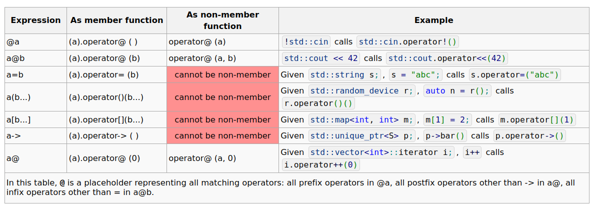
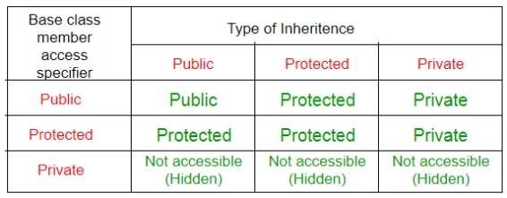

1) -- 
2) Практически не в чём, а  идейно - `NULL` - это `define`, а `nullptr` - это ключевое слово языка C++
3) Конструктор копирования - это конструктор принимающий константную ссылку. 
```c++ 
class Object
{
    Object(const Object& obj)
    {...}
};
```
Его следует применять, когда существуют поля-указатели 

4) Ссылка должна быть определена при объявлении и не может менять объект, на который она указывает. В отличии от указателя.
```c++
int& link    = k; // ссылка
int* pointer;     
pointer = &k;

link++; // значение в переменной k увеличилось на единицу
pointer++; // указатель сдвинулся на следующую после ячейки с переменной k позицию
```

5) 
* Чтобы не копировать объект при вызове функции
* Чтобы при изменении объекта в функции он менялся и на глобально
---

6) 
```c++
    class Math
    {
        public : 
        static double PI;
        
        static double cos(double angle);
    };

    class Human
    {
        static int human_cnt = 0;

        ...

        Human()
        {
            ...
            human_cnt++;
        }
    };
```

7) Операторы и места их объявления 
    
    Не перегружаемые операторы:
    * .
    * .*
    * ->*
    * ::
    * &
    * ? :
    * static cast

    ```c++
    int x = (int)aaa;       // C style
    int y = int(aaa);       // вызов конструктора
    int z = static_cast<int>(aaa); // new C++ cast
    ```

8) Константный метод класса может быть вызван от константной ссылки или указателя, а так же ему запрещено менять поля this
```c++
class Rectangle
{
    double x;
    double y;

    double height;
    double width;

    public:
        GetX() const 
        { 
            return x; 
        }
};
```

9) Наследование - великая парадигма!!!
Нужна для переиспользования кода, полиморфизма

10) Не владею вашей терминологией. Лучше посмотреть по записям

11) Конструкторы базовых классов вызываются перед конструктором производного класса слева направо.  Диструкторы базовых классов - после деструктора производного справа налево
```c++
class Student : Human, Mem
{
    Student()
    // Вот тут вызовется сначала конструктор Human, затем конструктор Mem
    {
        ...
    }

    ~Student()
    {
        ...
        // Вот тут, после всех функций будут вызваны диструкторы сначала для Mem, затем для Human 
    }
}
```

12) Типы наследования
* public
* private
* protected



* (virtual)

13) ```c++
    class Object
    {
        ...
        virtual void Draw(double x, double y);
    }

    class Rect : Object
    {
        ...
        void Draw(double x, double y) override;
    }

    class Circle : Object
    {
        ...
        void Draw(double x, double y) override;
    }

    int main()
    {
        int x, y;
        int n;
        Object* scene = ...;

        for (int i = 0; i < n; i++)
            scene.Draw(x, y);
    }
    ```

14) ```c++
    struct s    
    {
    	int x;
    	double d;
    };

    s aboba = {0, 1};

    auto[x1, d1] = aboba;
    ```